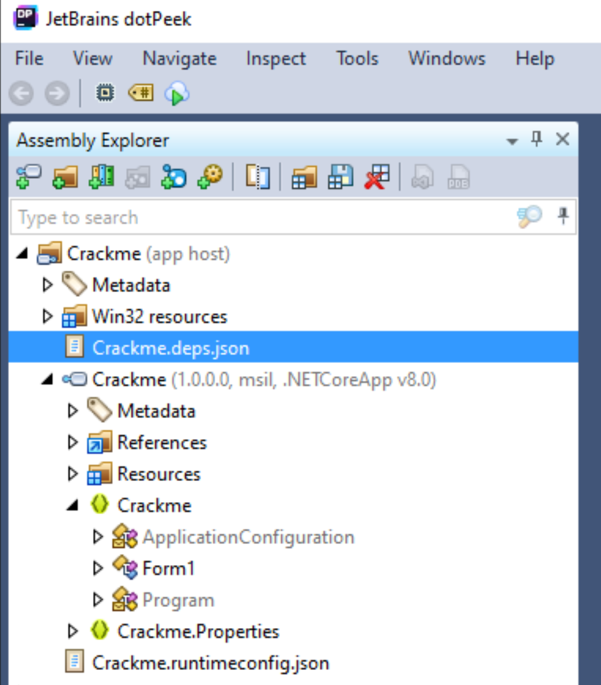

# Lab 3

1. Download binaries
2. Unzip (Password is crackmes.one)
3. Open dotPeek
4. Drag in Crackme.exe from first download
5. Expand the tree in dotPeek to look like this

6. Double Click Form1
7. Notice Code expands to the right
8. Figure out what code does and call out flag (No CTF for these walkthroughs)

That one was too easy, lets do a harder one.

1. Unzip the OTHER crackme (Password is crackmes.one)
2. Drag it into dotPeek (Crackme Johns Dialer)
3. Expand the Main Program (Not the DO_NOT_LOOK, do Form1)
4. Work out what the code is doing, run it and submit the challenge
5. Give the flag out

This one is a WEE bit harder but not too bad!

