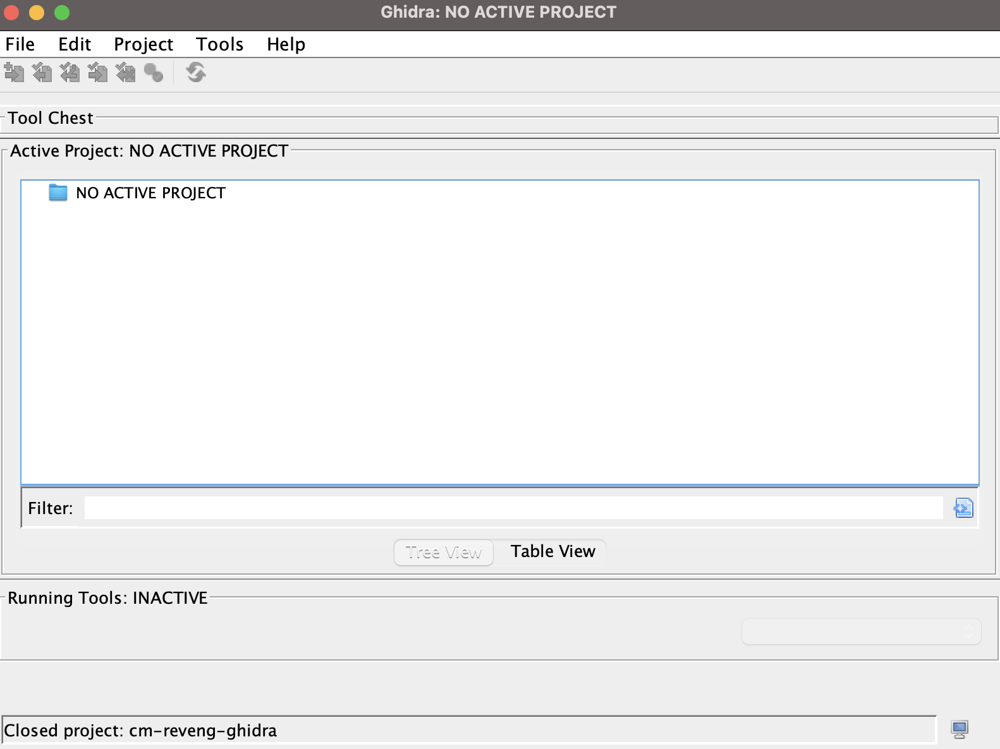
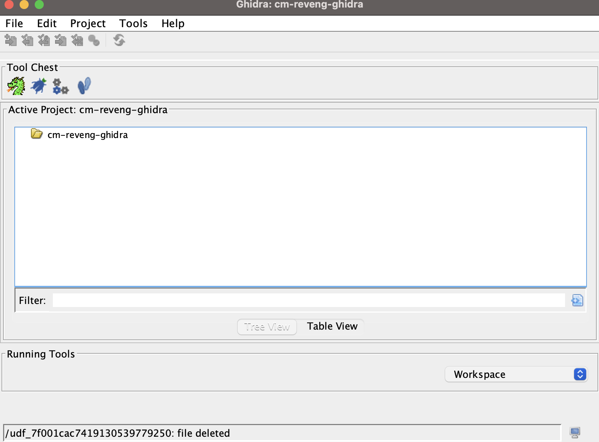
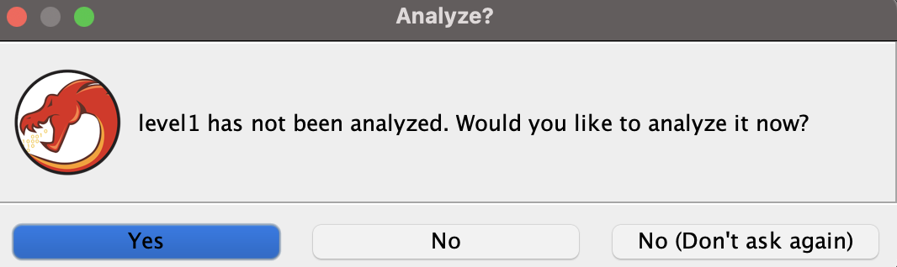
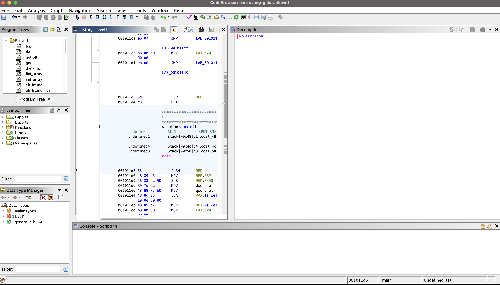

# Lab 4

1. Download Binary
- https://crackmes.one/crackme/646627a933c5d439389131d9
2. Open Ghidra
3. Make new project when here

4. File->New Project
5. Give it a name
6. When here go file->Import

7. Choose level1 binary
8. Click OK with defaults
9. Make sure no errors on Import Results window (Mac may need some work) then click OK
10. Double click level1
11. On Analyze window click yes

12. Click Analyze, accepting the default options
13. On main window expand functions and open main

14. Explore the program and find the key

---

Hints:
1. Look at the checkPass function
2. It reads a bit easier if you make variable names shorter
3. The C code isn't "perfect" but it's good in this binary

